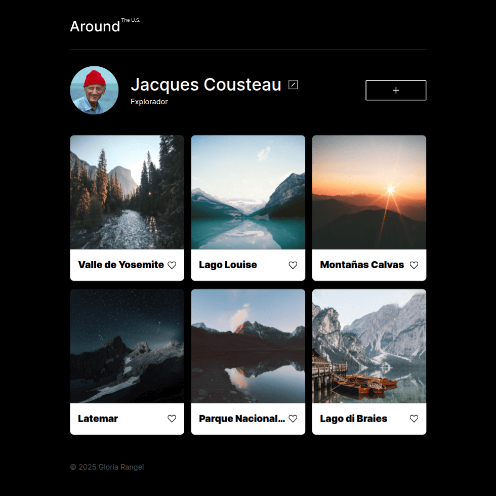
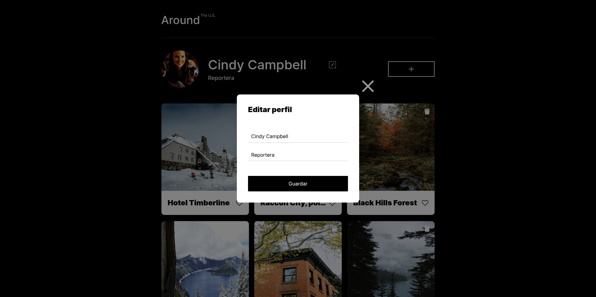
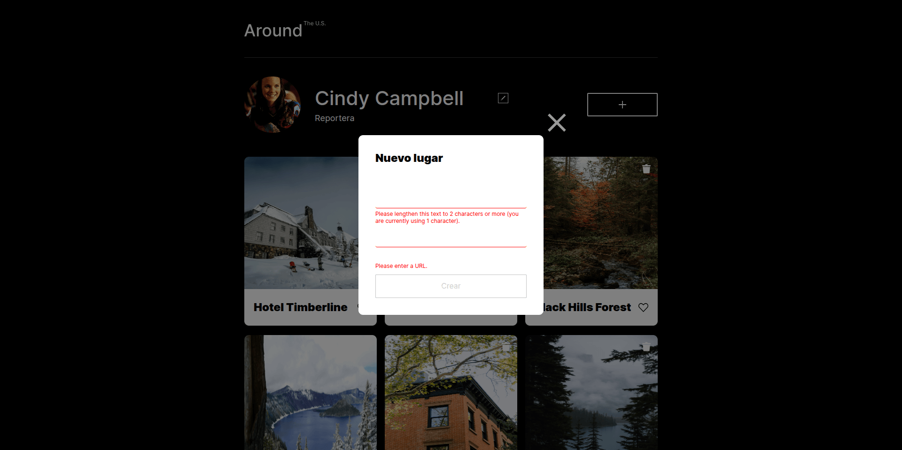
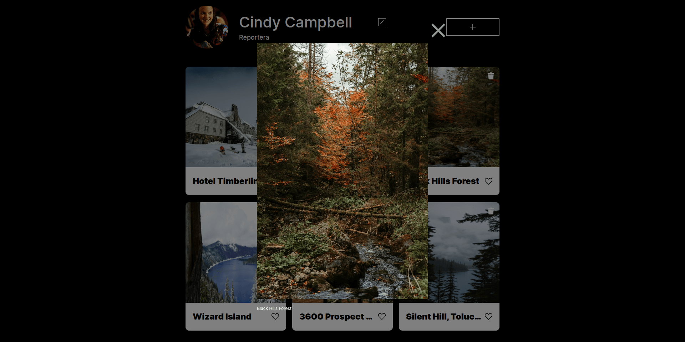

# Alrededor de los EE. UU. 🇺🇸📸

## 📝 Descripción del proyecto

**"Alrededor de los EE. UU."** es una galería web interactiva creada como parte del décimo proyecto del bootcamp de desarrollo web de [TripleTen](https://tripleten.com/). Ofrece una experiencia de usuario completa que incluye validación de formularios, visualización de errores en la interfaz, edición de perfil, creación de nuevas tarjetas con imagen, botones de “me gusta” y eliminación. Además, incorpora accesibilidad mejorada al permitir cerrar ventanas emergentes tanto con el teclado como haciendo clic fuera de ellas..

### 🖱️ Funcionalidades implementadas:
- Ventanas modales con funcionalidad de abrir/cerrar.
- Edición del perfil directamente desde un formulario emergente.
- Visualización de una galería de lugares destacados en Estados Unidos.
- Estructura modular del código basada en JavaScript puro.
- Diseño responsivo para distintas resoluciones.
- Botón de "like"que cambia de estado activo/inactivo.  
- Botón para eliminar tarjeta, que permite removerla de la galería.  
- Vista ampliada de la imagen mediante un popup modal al hacer clic sobre la foto.
- Validación de formularios.
- Cierre de popup haciendo clic en superposición y al pulsar tecla *Esc*.

### 💻 Tecnologías utilizadas:
- HTML5
- CSS3
- ES6
- Figma
- JavaScript (DOM, eventos, manipulación de nodos, módulos)
- POO
- Metodología BEM
- Git & GitHub Pages

### 🚀 Despliegue
Puedes ver el proyecto en línea accediendo a través del siguiente enlace:

🔗 [https://norimnori.github.io/web_project_around/](https://norimnori.github.io/web_project_around/)

### 📷 Capturas de pantalla:

## 💡 Planes de mejora

A futuro, me gustaría implementar las siguientes mejoras:

- Incorporar almacenamiento local o backend para persistencia de datos.
- Añadir animaciones suaves al abrir/cerrar popups.
- Reestructurar el código con clases de JavaScript para mejor mantenimiento.

---

Este proyecto marcó el inicio de mi práctica con JavaScript puro aplicado al DOM, permitiéndome combinar habilidades visuales y funcionales para crear interfaces más dinámicas y centradas en el usuario.
