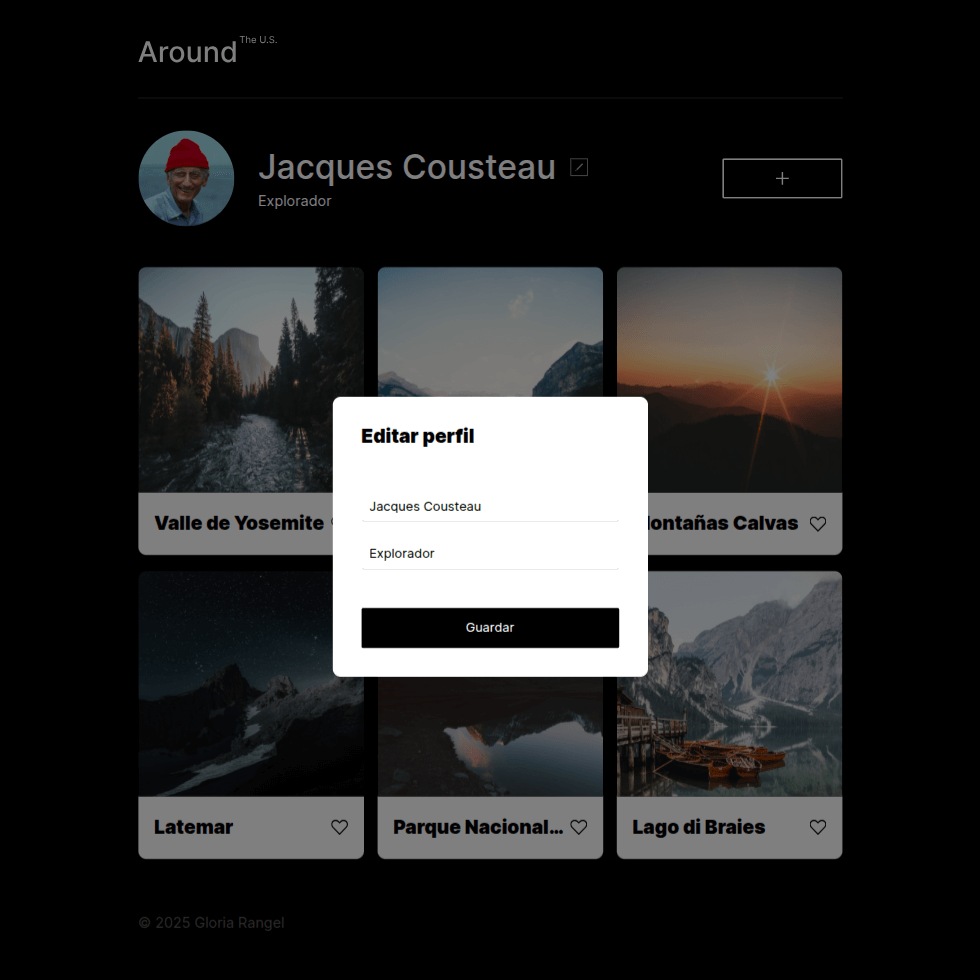

# Alrededor de los EE. UU. 🇺🇸📸

## 📝 Descripción del proyecto

**"Alrededor de los EE. UU." (Parte 1)** es una galería web interactiva creada como parte del séptimo proyecto del bootcamp de desarrollo web de [TripleTen](https://tripleten.com/). En esta primera etapa, el enfoque estuvo en manipular el DOM con JavaScript puro, permitiendo editar información del perfil, agregar tarjetas nuevas y abrir ventanas emergentes.

### 🖱️ Funcionalidades implementadas:
- Ventanas modales con funcionalidad de abrir/cerrar.
- Edición del perfil directamente desde un formulario emergente.
- Visualización de una galería de lugares destacados en Estados Unidos.
- Estructura modular del código basada en JavaScript puro.
- Diseño responsivo para distintas resoluciones.

### 💻 Tecnologías utilizadas:
- HTML5
- CSS3
- JavaScript (DOM, eventos, manipulación de nodos)
- Metodología BEM
- Git & GitHub Pages

### 🚀 Despliegue
Puedes ver el proyecto en línea accediendo a través del siguiente enlace:

🔗 [https://norimnori.github.io/web_project_around/](https://norimnori.github.io/web_project_around/)

### 📷 Capturas de pantalla:

## 💡 Planes de mejora

A futuro, me gustaría implementar las siguientes mejoras:

- Agregar la funcionalidad de dar “me gusta” a las tarjetas.
- Habilitar la eliminación de tarjetas individualmente.
- Incorporar almacenamiento local o backend para persistencia de datos.
- Añadir animaciones suaves al abrir/cerrar popups.
- Reestructurar el código con clases de JavaScript para mejor mantenimiento.

---

Este proyecto marcó el inicio de mi práctica con JavaScript puro aplicado al DOM, permitiéndome combinar habilidades visuales y funcionales para crear interfaces más dinámicas y centradas en el usuario.
